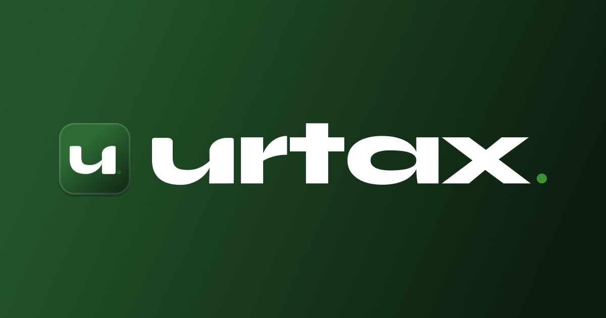

  

<h1 align="center">urtax.</h1>

<strong>Your personal money system.</strong>

  <a href="https://urtax.com">🔗 urtax.com</a> &nbsp;·&nbsp;
  
  
  

---

**urtax** is a lightweight, zero-signup budgeting tool that lets you split your income into fully custom categories — instantly. No accounts. No complexity. Just your money, your way.

---

## Features

| | |
|---|---|
| 💰 **Custom Categories** | Name and assign any spending bucket you want |
| 📊 **Live % Tracking** | Total and remaining percentage updates in real time |
| ➕ **Add & Remove Cards** | Full control — up to 6 categories |
| 📄 **Blank Template** | Start fresh with a clean slate |
| 💡 **Example Template** | Load a pre-built investment allocation to get started fast |
| 💾 **Persisted State** | Your categories save automatically between sessions |
| 📱 **Mobile Optimized** | Numeric keypad, responsive layout, home screen icon support |
| ❌ **No Signups** | Open and use — nothing required |

---

## How It Works

1. Enter your income or any dollar amount
2. Set up your categories and assign a percentage to each
3. Hit **Calculate** — urtax instantly breaks down the exact dollar amount per bucket
4. Adjust on the fly until percentages hit 100%

Think of it as a digital envelope system, built for how you **actually** live.

---

## Stack

- Vanilla HTML / CSS / JavaScript
- Google Fonts — [Syne](https://fonts.google.com/specimen/Syne) + [Outfit](https://fonts.google.com/specimen/Outfit)
- `localStorage` for persistence
- Zero dependencies, zero frameworks
